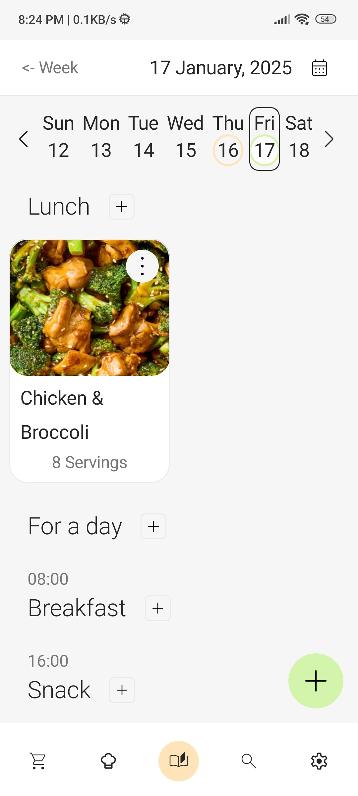
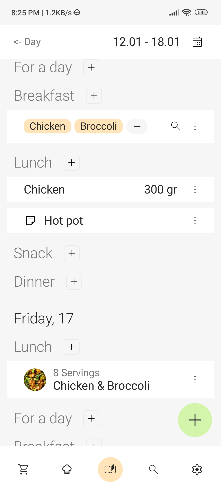
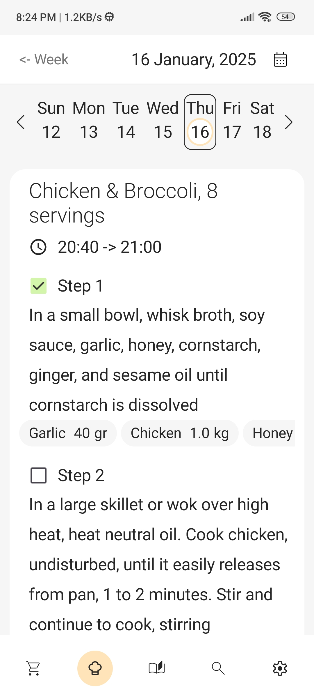
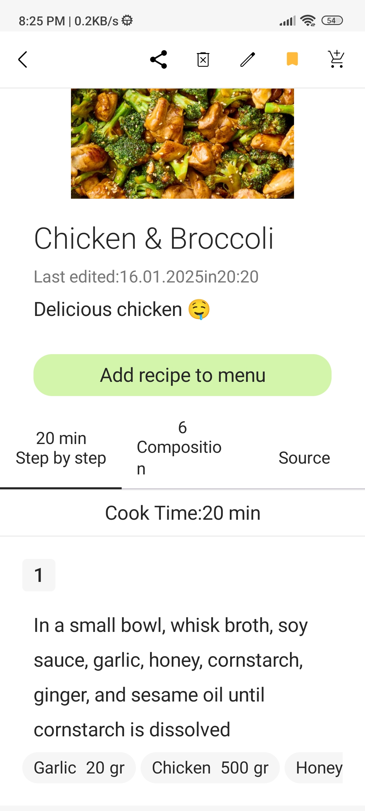
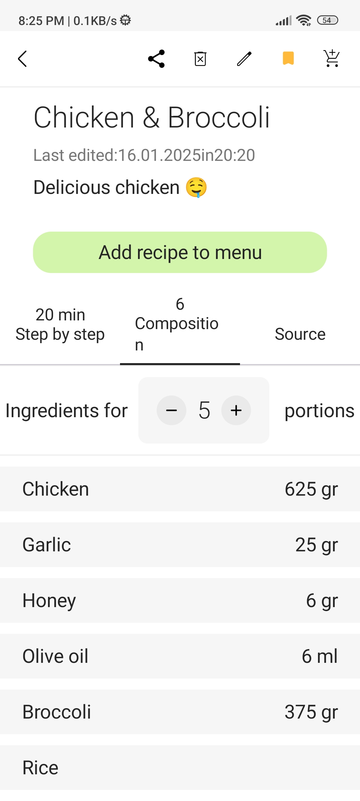
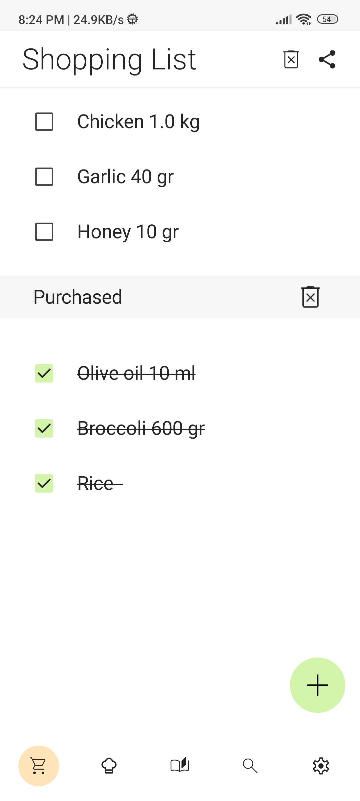
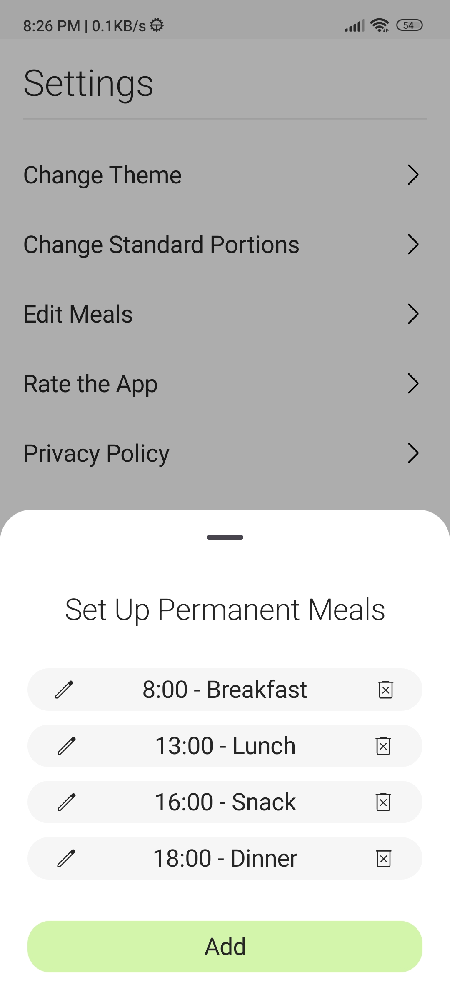

  

  
<b>Неделя на тарелке</b> - ваш незаменимый помощник для регулярного приготовления еды: книга рецептов, составление меню и список покупок.

Основные функции:

Рецепты:
- Сохранение своих рецептов
- Быстрое добавление рецепта из интернета по ссылке
- Добавление таймера к шагам приготовления рецепта, чтобы стартовать его во время приготовления в один клик
- Автоматический пресчёт ингредиентов в рецепте по порциям

Поиск:
- Мощный поиск сохраненных рецептов по множеству критериев (избранное, теги, ингредиенты, время приготовления)

Меню:
- Составление меню на неделю (подробного или быстрого)
- 2 вида представления меню: краткий для недели или подробный для определенного дня
- Добавление заметок в меню
- Добавляйте отдельные продукты в меню, например если захочется быстрый перекус
- Быстрое создание наброска меню с помощью ингредиентов и тэгов (способ приготовления, кухня мира и так далее)

Планнер готовки: 
- План готовки, чтобы планировать приготовление блюда на определённый день
- Отмечайте выполненные шаги, чтобы следить за приготовлением 

Список покупок:
- Быстрое составление списка покупок с помощью голосового поиска по ингредиентам
- Генерация списка покупок для одного или нескольких рецептов в пару кликов

Приятное:
- Делитесь списками покупок и рецептами в один клик
- Полная гибкость и кастомизация: меню, теги, ингредиенты, приёмы пищи – всё можно подстроить подстраивается под ваши привычки (чтобы изменить или удалить ингредиент, тэг или категорию нажмите на три точки справа от него, чтобы добавить нажмите на зелёную кнопку плюс на экране фильтров)
- Интеграция таймеров и фотографий на каждом этапе готовки для максимального удобства

  

Скриншоты:

  

  

<table align = "center">
<tr>
  <td>
    
 Технологии: 
 
    <ul>
    <li>Kotlin</li>
    <li>Jetpack Compose</li>
    <li>Room</li>
    <li>Coroutines + Flow</li>
    <li>Navigation Compose</li>
    <li>Hilt</li>
    </ul>
  </td>
  </tr>
</table>
